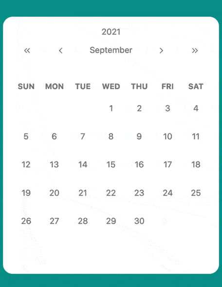
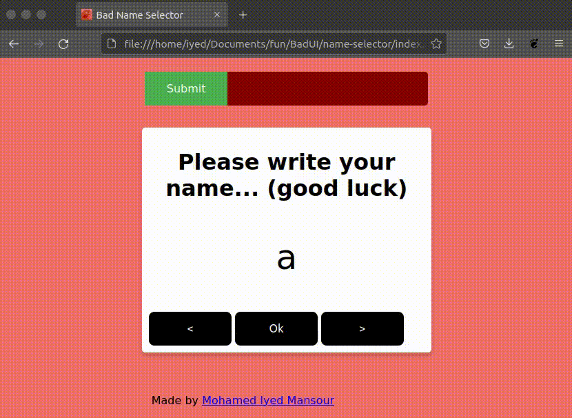
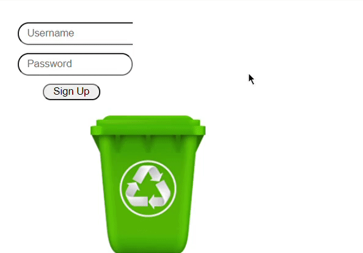
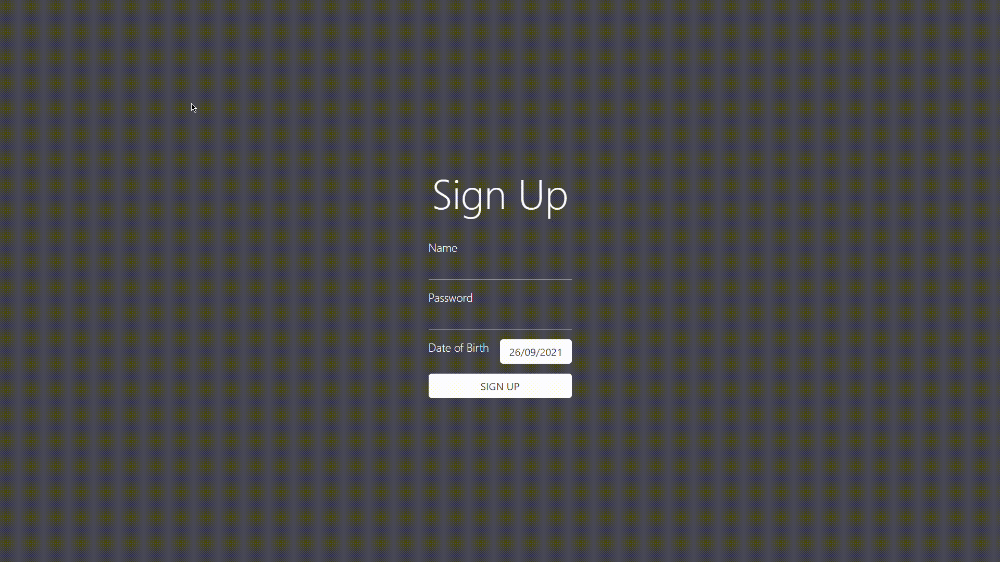
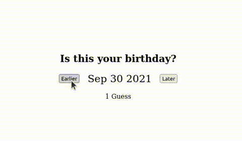

# Bad UI Battle

Inspired by [r/badUIbattles](https://www.reddit.com/r/badUIbattles/) (a joke subreddit for intentionally bad UI designs), I created [BadUI](https://goulartnogueira.github.io/BadUI) as an open repository for BadUI's made by me and others.

This repository contains all ~~best~~ *(or worst?)* bad-UI I've seen.

Feel free to [contribute](https://github.com/GoulartNogueira/BadUI/pulls) with your own *💩 UI*!

---

## 1. Phone Slider Selector
- [Source Code](https://github.com/GoulartNogueira/BadUI/tree/master/Phone-Slider-Selector/BadUIPhone.html)
### - [Live Interactive Example!!!](https://goulartnogueira.github.io/BadUI/Phone-Slider-Selector/BadUIPhone.html)

---

## 2. Bad UI Birthday
- [Source Code](https://github.com/GoulartNogueira/BadUI/tree/master/Date/BadUIDate.html)
### - [Live Interactive Example!!!](https://goulartnogueira.github.io/BadUI/Date/BadUIDate.html)
  

---

## 3. Calendar Hell (by [Jean Dupouy](https://github.com/izeau)) 📅 ️‍🔥
- [Source Code](https://github.com/izeau/calendar-hell)
### - [Live Interactive Example!!!](https://goulartnogueira.github.io/BadUI/calendar-hell)

### Made with 💩 and 💖 by André Goulart Nogueira:

- [LinkedIn](https://www.linkedin.com/in/andre-goulart/)
- [GitHub](https://github.com/GoulartNogueira)
- [StackOverflow AI](https://ai.stackexchange.com/users/49188/andre-goulart)

---

## 4. Bad Name Selector (by [Mohamed Iyed Mansour](https://github.com/imansour12))
- [Source code](https://github.com/GoulartNogueira/BadUI/tree/master/bad-name-selector)
### - [Live Interactive Example!!!](https://goulartnogueira.github.io/BadUI/bad-name-selector)

---

## 5. The best way to limit username size (by [Emre Ünlütürk](https://github.com/i01000101))
- [Source code](https://github.com/i01000101/RedditBadUIBattles/tree/main/LimitUsernameSize)
### - [Live Interactive Example!!!](https://goulartnogueira.github.io/BadUI/LimitUsernameSize)

---

## 6. Scientific Date Picker (by [Emre Ünlütürk](https://github.com/i01000101))
- [Source code](https://github.com/i01000101/RedditBadUIBattles/tree/main/)
### - [Live Interactive Example!!!](https://goulartnogueira.github.io/BadUI/ScientificDatePicker)

---

## 7.  (by [Nifty Octopus](https://www.reddit.com/user/NiftyOctopus_/))
- [Source code](https://codepen.io/NiftyOctopus/pen/rNwRNYp)
- [Reddit Original Post](https://www.reddit.com/r/badUIbattles/comments/pycos8/a_fun_way_to_select_your_birthday/)
### - [Live Interactive Example!!!](https://goulartnogueira.github.io/BadUI/HighLowBirthday)

---
